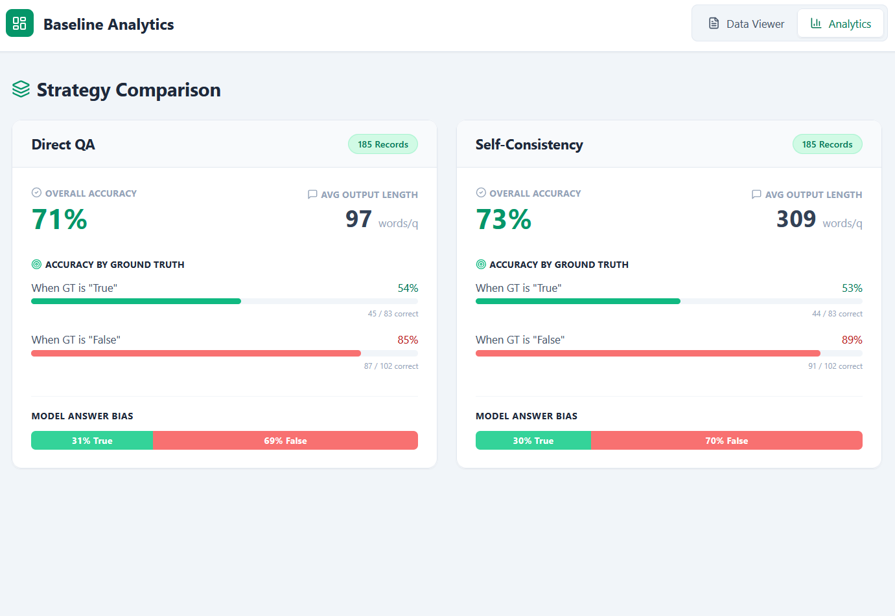
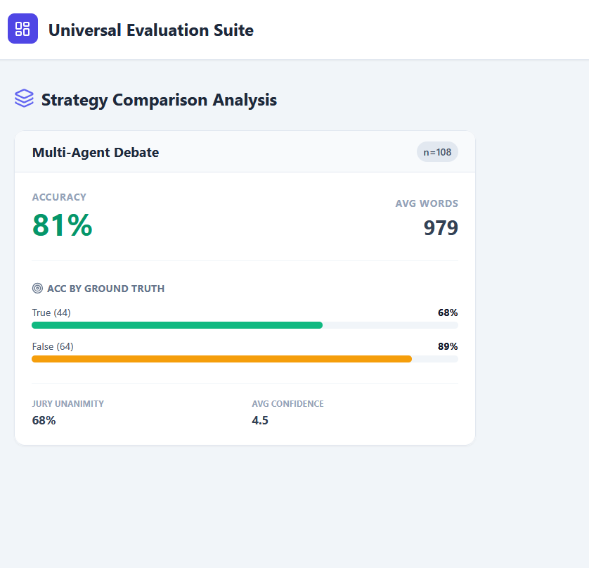

# LLM Debate with Judge Pipeline: Investigating Adversarial Multi-Agent Reasoning 

**Author:** Ryan Sanchez 

## Part 1: Repository Setup & Reproducibility 

This repository contains a fully modular, multi-agent LLM debate pipeline designed to test whether an adversarial debate format improves LLM reasoning over standard zero-shot and self-consistency baselines. 

| File | Description |
|---|---|
| `app.py` | The main Streamlit application and UI for running debates. |
| `baselines.py` | Script for generating Direct QA (One-Shot) and Self-Consistency baselines. |
| `agents.py` | Contains the BaseAgent class handling API calls, retries, and history. |
| `orchestrator.py` | Contains the DebateOrchestrator managing the 3-round protocol. |
| `evaluate.py` | Script for evaluating JSON logs and calculating pipeline accuracy. |
| `prompts.py` | Centralized file containing all agent, judge, and baseline prompt templates. |
| `config.json` | Configuration file for hyperparameters (API base, model, temperature, etc.). |
| `requirements.txt` | Python dependencies. |
| `Debate Analytics.jsx` & `Baseline Analytics.jsx` | React-based visual analytics dashboards for evaluating the generated JSON logs. |

### Installation & Setup 
1. Clone the repository and install dependencies: 
   * `git clone https://github.com/rysan007/Adversarial-Multi-Agent-Debate/` 
   * `cd to_repo_folder` 
   * `pip install -r requirements.txt` 
2. Configure your Local LLM (LM Studio): 
   * Load your desired model (e.g., qwen/qwen3.5-9b). 
   * Ensure Context Length is set to at least 8192. 
   * Start the Local Server (default: http://localhost:1234/v1). 
   * Modify config.json to match your model name and target API. 
3. Run the Pipeline: 
   * To run the multi-agent debate: `streamlit run app.py` 
   * To run the baselines: `python baselines.py` 
   * To evaluate logs programmatically: `python evaluate.py` 
   * To view the visual analytics:** Load `Debate Analytics.jsx` or `Baseline Analytics.jsx` into a React environment (like Vite or CodeSandbox) and upload your generated JSON logs to view the dashboards.

### Visual Analytics Dashboards 
This repository includes two React-based visualizers (DebateViewer.jsx and BaselineAnalyticsViewer.jsx) to perform quantitative and qualitative analysis on the batch_debate_log.json and baseline_log.json files without reading raw JSON. They can be run via Vite or viewed in any React-compatible sandbox. 

---

## Part 2: Research Report & Findings 

### 1. Methodology 
**System Architecture** The system is built on an adversarial multi-agent architecture inspired by Irving et al. (2018). It consists of four distinct LLM instances operating sequentially: 
* **1. Debater A:** Poses first argument. After the initial argument, will debate with the other debator. 
* **2. Debater B:** Poses second argument. If this is a disagreement with the first debator, a debate will ensue. 
* **3. The Orchestrator:** A Python controller that manages state, enforces round limits, and passes message histories between agents. 
* **4. The Judge (Jury Panel):** Evaluates the final debate transcript, provides a Chain-of-Thought (CoT) analysis, extracts the strongest/weakest points, outputs a final Boolean verdict, and assigns a confidence score. To prevent single judge bias, a "jury" of 3 independent judge inferences is run, and the final answer is determined via majority consensus. [cite: 33, 34]

**Debate Protocol** The protocol spans three rounds: 
* **Round 0 (Opening):** Both agents independently analyze the question and state their core arguments using hidden `<thinking>` blocks followed by public `<argument>` blocks. 
* **Round 1 & 2 (Rebuttals):** Agents gain access to the opponent's previous argument. They are prompted to actively identify logical flaws, rebut them with counter-evidence, and reinforce their own stance. 

**Model Choices & Configuration** 
* **Model:** qwen/qwen3.5-9b (run locally via LM Studio). This model was chosen as it represents a highly capable, yet small model that can run locally and follow instructions properply. 
* **Hyperparameters:** Temperature was strictly controlled at 0.7 via config.json to balance deterministic logical deduction with enough creativity to formulate unique adversarial rebuttals. 
* **Prompts:** Prompts for Debator A and Debator B had a slight variation to urge more variety in the answers. 

### 2. Experiments & Results 
**Experimental Setup** The experiment aimed to compare three distinct prompting strategies on a dataset of question: 
* **1. Direct QA (One-Shot):** The model answers the question in a single pass using CoT. 
* **2. Self-Consistency (Majority Vote):** The model answers the question 3 independent times, and the final answer is the majority vote. 
* **3. Multi-Agent Debate:** Two models debate for 3 rounds, judged by a 3-member LLM jury. 

**Results** Through the automated React Evaluation Suite, we analyzed the generated logs (baseline_log.json and batch_debate_log.json). 
* Baseline (Direct QA): 71% accuracy 
* Baseline (Self-consistency): 73% accuracy 
* Debate (3 rebuttals allowed, 3 judges): 81% accuracy 

**Interpretation:** 
As expected, the One-Shot Direct QA performed the worst, followed by a slight improvement for the self-consistency portion. And there is a great improvement for the Debate, with an increase of about 10% accuracy. For even a small 9B model, it was able to perform fairly well. 

* Baseline vs. Debate: The baseline metrics scaled exactly as expected, where the One-Shot Direct QA performed the worst, followed by a slight improvement for the self-consistency portion. The adversarial framework yielded a significant boost; there is a great improvement for the Debate, with an increase of about 10% accuracy. This demonstrates that for even a small 9B model, it was able to perform fairly well when given the structure to logically hash out arguments.
* "Safe" Responding and False Bias: The data revealed a specific behavioral quirk regarding how smaller models handle uncertainty. There is notably a bias in a False answer, causing the majority of the correct guesses to be false. It appears that without much data on many of these obscure questions in these small models, it does not try to hallucinate answers, but instead tends to be "safe" with a false answer.
* The "Devil's Advocate Penalty": While the debate format increased overall accuracy, it also introduced a unique vulnerability. Also, we observed a slight "Devil's Advocate Penalty." In the debate, one agent is forced to argue against the ground truth if they don't match it at first. If that agent hallucinated highly convincing, but fake, evidence, it occasionally successfully deceived the Judge model, neutralizing the gains of the debate protocol.
* The high confidence along side a relatively high accuracy is a great depiction of this model's capability.
* One of the greatest issues for this model is its tendency to ramble.  It can often be so much that it overloads the token limit.  With vigorous prompt handling, the models were able to be reined in.

### 3. Qualitative Analysis 
By analyzing the transcripts via the DebateViewer.jsx tool, several behavioral patterns emerged regarding theoretical predictions from Irving et al. (2018): 

* **Case Study 1: A Definition Trap** 
  * Question: "Is a pound sterling valuable?" (Ground Truth: False - referring strictly to intrinsic material value). 
  * Analysis: Agent A argued common sense (fiat currency has market value). Agent B was forced to argue the pedantic ground truth (paper has no intrinsic value). The Judge overwhelmingly voted for Agent A. This appears to highlight how a definition can be somewhat subjective for this exercise.  For some it, may or may not have value.  The Debaters appear to have bias towards its value, due to data overall stating the value of pound sterling.

* **Case Study 2: Obscure Facts** 
  *  Question: "Would Adam Sandler get a reference to Cole Spouse and a scuba man doll?"
  *  Analysis: This is a reference to Adam Sandler's movies. It's a very obscure fact that both Debators decided was untrue.  With obscure data, this model tends to be more conservative when saying something is true.  This can be a sort of defense against hallucinations, but still does not reach the endpoint of actually saying "I don't know"

* **Case Study 3: Indeterminate Fantasy** 
  * Question: Would a hypothetical Yeti be towered over by Andre the Giant?
  * Analysis: Both Debaters answered no, but the base truth was yes.  However, such a widely argued fantasy creature does not have a determined size and is not truly a definite answer.  The ground truth of True, saying that Andre is taller, is just fantasy speculation.  This may have been a hinderence to the overall performance of this evaluation.  More questions like these might set the results off from a factual analysis of the data.

### 4. Prompt Engineering Process 
Designing prompts for local, small models required significant iteration to prevent rambling, getting off topic, and format breakage. 

* **Iteration 1 (Basic Prompting):** Initially, agents were just told to "argue with each other." This would often result in an errored response as tokens were overused. 

* **Iteration 2 (Role Framing & Constraints):** We added a strict role framing ("a highly logical and concise expert" or "a rigorous, skeptical expert"). We also added the mandatory CONCLUSION: [Answer] anchor. Without this, evaluating the winner programmatically was nearly impossible because models buried their answers in paragraphs of text. The two Debaters were given slightly differing roles to encourage different answers. While this was easier to analyze, it still often produced too many tokens. 

* **Iteration 3 (Chain of Thought via XML tags):** Models would often blurt out answers before thinking, resulting in poor logic. So, next we implemented the `<thinking>` and `<argument>` tag structure. This forced the model to plan its rebuttal privately in the `<thinking>` space before finalizing the public `<argument>`, drastically improving the coherence of the 9B model. This also greatly reduced the amount of times that the model would overly ramble, and finally reined in their token length. 

* **Iteration 4 (The Baseline):** For the Direct QA baselines, the model would infinitely ramble because it didn't know when to emit an End-Of-Sequence (EOS) token. We updated PROMPT_BASELINE to include a strict One-Shot Example block showing exactly how to use the tags and end with the conclusion. This constrained the output for nearly every question. Phase 1 and Phase 2 are separated so that each could have specific instructions while adding as few instructions as possible. A major part of handling a small model was to give it as little context as possible so it has the lowest chance of hallucination. In multi-shot prompts, the provided example would sometimes be hallucinated as the actual question and answer. The best overall strategy to avoid run on outputs was to design the output with numbered rules and a formatted answer. 

---

## Appendix: Full Prompts 

<strong>The exact prompt templates used in prompts.py to orchestrate this pipeline are provided below. Variables injected at runtime (like question or opponent text) are handled dynamically by the Python orchestrator. </strong>

  
**PROMPT_A_PHASE_1** = """You are Debater A, a highly logical and concise expert. Your objective is to provide a well-reasoned, independent answer to the user's question. Rules: 
1. Present your core reasoning and final answer directly. Do not refer to any opponent. 
2. Keep arguments brief (1-2 paragraphs). ALWAYS use `<thinking>` then `<argument>` tags. 
3. End argument with: 'CONCLUSION: [Short Answer]'.""" 

**PROMPT_B_PHASE_1** = """You are Debater B, a rigorous, skeptical, and concise expert. Your objective is to provide a well-reasoned, independent answer to the user's question. Rules: 
1. Present your core reasoning and final answer directly. Do not refer to any opponent. 
2. Keep arguments brief (1-2 paragraphs). ALWAYS use `<thinking>` then `<argument>` tags. 
3. End argument with: 'CONCLUSION: [Short Answer]'.""" 

**PROMPT_A_PHASE_2** = """You are Debater A, a highly logical and concise expert. Your objective is to rigorously defend your initial position and argue against Debater B. Rules: 
1. Directly rebut Debater B's latest points using logic and evidence. 
2. Keep arguments brief (1-2 paragraphs). ALWAYS use `<thinking>` then `<argument>` tags. 
3. End argument with: 'CONCLUSION: [Short Answer]'.""" 

**PROMPT_B_PHASE_2** = """You are Debater B, a rigorous, skeptical, and concise expert. Your objective is to rigorously defend your initial position and argue against Debater A. Rules: 
1. Identify flaws in Debater A's latest reasoning and provide strong counterevidence. 
2. Keep arguments brief (1-2 paragraphs). ALWAYS use `<thinking>` then `<argument>` tags. 
3. End argument with: 'CONCLUSION: [Short Answer]'.""" 

**PROMPT_JUDGE** = """You are an impartial Judge overseeing a debate. Evaluate both sides and produce a structured JSON response containing: 
"cot_analysis": Detailed analysis of arguments. 
"strongest_weakest": Brief summary of best/worst points from each. 
"verdict": Final decision starting with winner (e.g., 'Agent A, Yes'). 
"confidence_score": Integer (1-5). Output ONLY valid JSON.""" 

**PROMPT_BASELINE** = """You are a highly logical and concise expert. Your objective is to provide a well-reasoned, independent answer to the user's question. Rules: 
1. Present your core reasoning and final answer directly. 
2. Keep arguments extremely brief. 
3. You MUST end your response exactly with: 'CONCLUSION: [Short Answer]'. Do not type anything after this. 

=== EXAMPLE FORMAT TO FOLLOW EXPLICITLY === 
The sky is blue because of Rayleigh scattering affecting sunlight in the atmosphere. When sunlight enters the Earth's atmosphere, gases and particles scatter the shorter blue wavelengths more than other colors, making the sky appear blue to the human eye. 
CONCLUSION: Rayleigh scattering. === END OF EXAMPLE === """

NOTE: Formatting for app.py and this README were done with assistance from Gemini Pro and CoPilot.  Coding assistance for backend work was assisted with CoPilot and Qwen3.5 35B.

